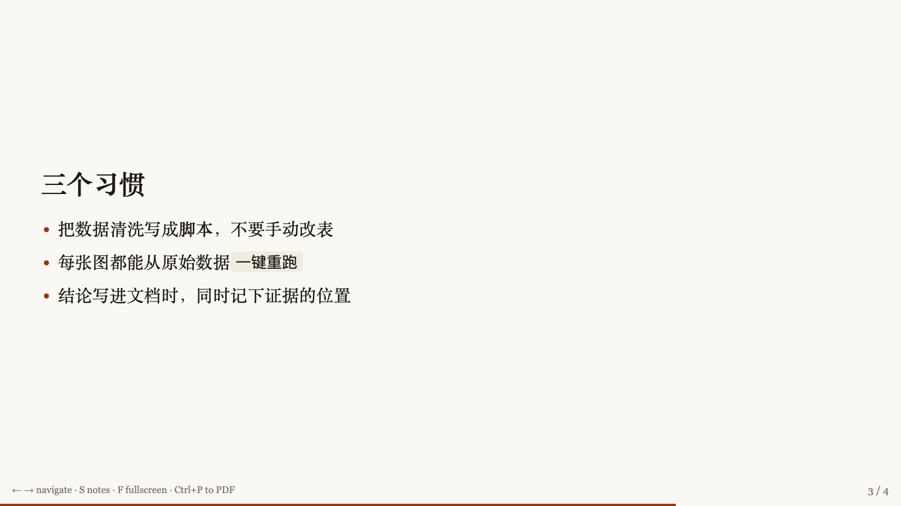
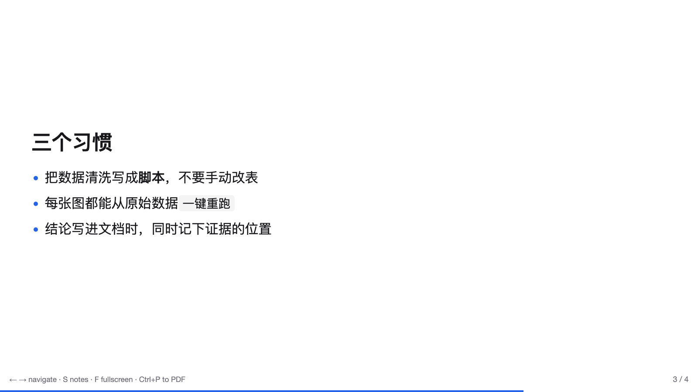
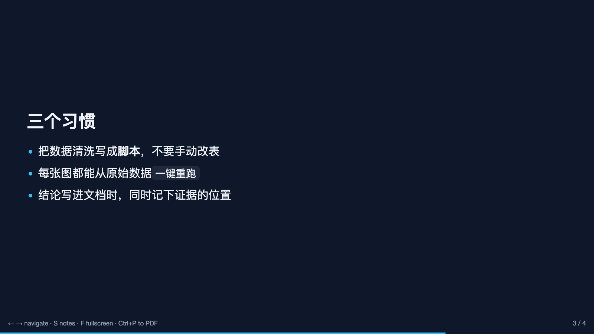
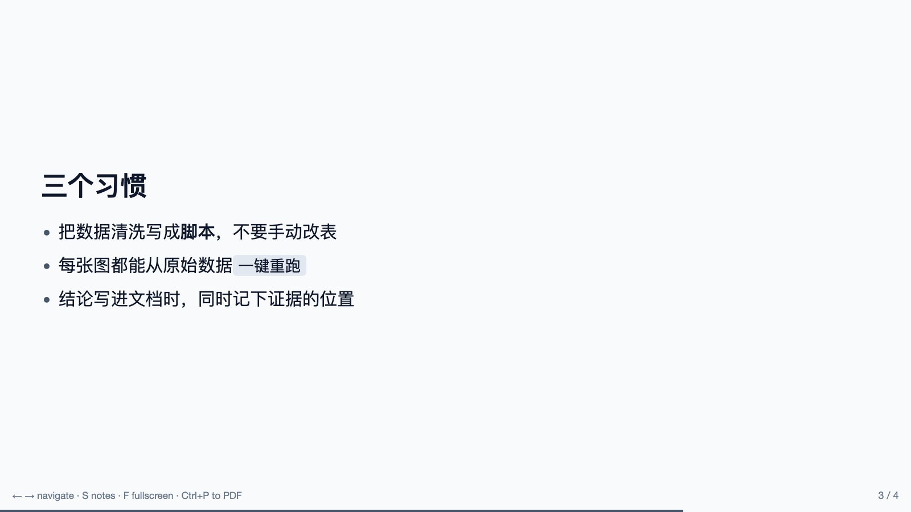
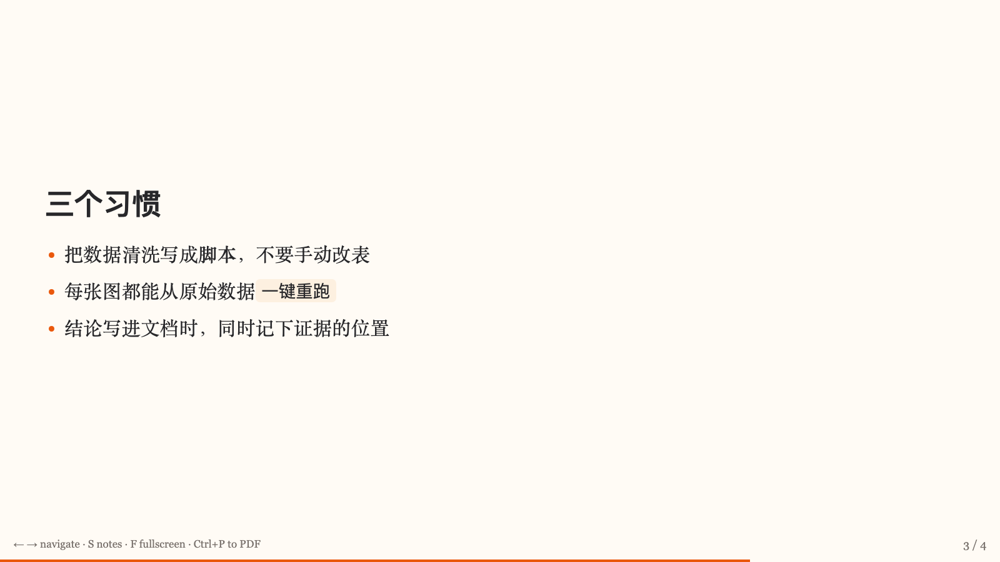

<p align="center"><strong>dsh-slides</strong></p>

# Slides for DeepSeek Harness

English | [中文](README_CN.md)

[](https://www.npmjs.com/package/dsh-slides) [](https://github.com/literaf/dsh-slides/actions/workflows/ci.yml) [](https://github.com/topics/dsh-plugin) 

Give the agent a `make_slides` tool and it writes a talk to **one HTML file** — opens in any browser, presents fullscreen, keeps your speaker notes off the screen, and prints to PDF with Ctrl+P.

The file loads nothing at presentation time. No CDN, no webfont, no image host. A deck that needs the network is a deck that can fail in the room you are presenting in.



## Install

```sh
dsh plugin --profile web add dsh-slides
dsh web
```

Then just ask: *"turn these results into a 10-minute talk"*.

## What the agent gets

One tool, `make_slides`, taking a deck as structured data rather than markdown the user has to convert:

| Layout | Holds |
|---|---|
| `title` | Deck title, subtitle, presenter. Generated for you from the deck fields — do not write one |
| `section` | A divider between parts of the talk |
| `bullets` | A claim as the heading, points beneath it, optionally a figure alongside |
| `image` | A figure with a caption, filling the slide |
| `quote` | A pulled quote with an attribution |

Omit `layout` and it is inferred from the fields you filled in.

Every slide takes `notes` — the speaker notes. They never appear on the slide; the presenter reveals them with `S` during the talk. This is the point of the tool: the claim goes on the slide, the talking goes in the notes, and the agent is told so in its guidance.

Bullets support `**bold**`, `*italic*` and `` `code` ``. Everything is escaped before formatting is applied, so content can never inject markup into the deck.

## Presenting

| Key | |
|---|---|
| `→` `←` `Space` | Next / previous slide |
| `S` | Show and hide speaker notes |
| `F` | Fullscreen |
| `Home` `End` | First / last slide |
| `Ctrl+P` | Print — one slide per page, chrome hidden, straight to PDF |

Clicking works too: the left third goes back, the rest goes forward. The URL carries the slide number, so a link can point at a specific slide.

## Themes

Five finished looks rather than a knob per property. Pick one; do not assemble one.

| Theme | |
|---|---|
| `plain` | White ground, sans-serif, thin accent rules. The default; disappears behind the content |
| `ink` | Warm paper ground with a serif face. Reads like a printed paper; suits a seminar or a defense |
| `midnight` | Deep blue ground, light type. Holds up in a bright room where a white deck washes out |
| `slate` | Neutral greys, no colour accent. For decks whose figures carry all the colour |
| `sunrise` | Off-white ground with a warm accent. A lighter register for a talk meant to persuade |

<p align="center">
  
  <br>
  
  
</p>

Font stacks name system faces only, for the same reason the deck loads nothing else.

## Configuration

The bundle inserts one row (`id: slides`). Override it from your profile's `cordis.patch.yml` (a patch replaces the whole `config`, so restate every key you keep):

```yaml
- id: slides
  config:
    outputDir: slides/       # where decks are written, relative to the workspace
    defaultTheme: plain      # plain | ink | midnight | slate | sunrise
    promptGuidance: true     # register the deck-writing guidance
    promptOrder: 150
```

## Notes

- Decks are written through `ctx.fs`, never `node:fs`, so a sandboxing filesystem backend fences the write like any other tool. The tool is therefore registered **only where a filesystem provider is composed** — with none, neither the tool nor its guidance appears, instead of offering a call that always fails.
- Images are yours to supply. A `data:` URI keeps the deck self-contained; an `https` URL works but makes the deck depend on that host at presentation time.
- This package renders decks and knows nothing about where the content came from. Packages that do — `dsh-paper-slides` for academic talks — compose beside it and drive `make_slides`.

## Known limitations

- **No `.pptx` export.** The harness filesystem capability exposes text writes only, and writing a binary any other way would go around the sandbox policy that fences every other tool. Print to PDF meanwhile; the export lands when there is a sanctioned seam for it.
- **No incremental reveal.** A slide appears whole. Builds and transitions are the kind of thing that reads as generated when an agent picks them.

## License

MIT
